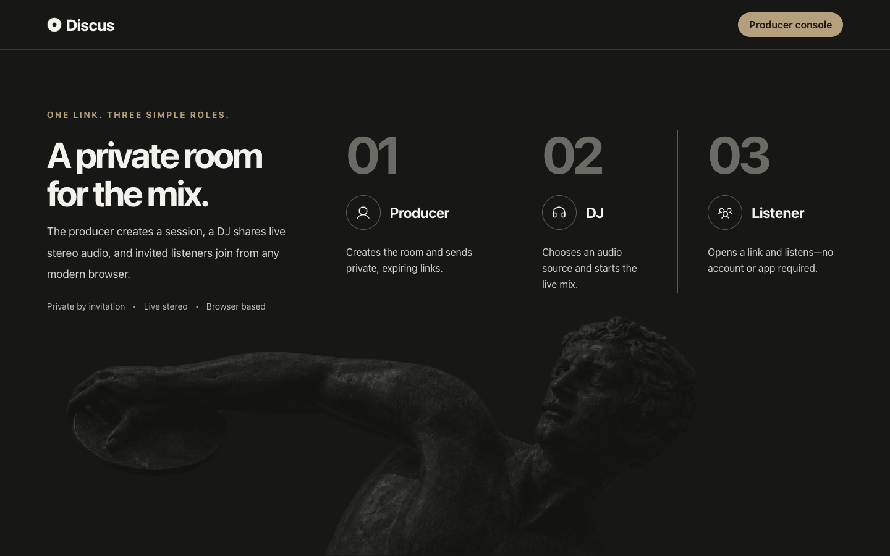

# Discus

Discus is a private, browser-based stereo audio relay for remote DJs. It publishes mixer or audio-interface input as Opus over WebRTC and provides separate private links for DJs and listeners.

## Features

- Private producer, DJ, and listener access
- WHIP/WHEP streaming through MediaMTX
- Stereo input metering and audio-device selection
- Live and historical listener counts
- Optional server-side session recording with private, multi-part replay
- Dark-only responsive interface
- Listener jitter buffering for steadier playback
- Docker deployment with Caddy-managed HTTPS

## Screenshot



## Development

Requirements: Node.js 24+, npm, and a Chromium-based browser.

```sh
npm install
ADMIN_PASSWORD=relay-test-password \
TOKEN_SECRET=dev-only-token-secret-at-least-32-bytes \
MEDIAMTX_AUTH_SECRET=dev-media-auth-secret \
npm run dev
```

Open `http://localhost:3000/admin`. Remote audio capture requires HTTPS.

Run the checks with:

```sh
npm run check
npm run test:e2e
```

## Deployment

Requirements:

- A Linux server with Docker Engine and the Docker Compose plugin
- A public DNS name pointed at the server
- TCP/UDP 443 and TCP/UDP 8189 allowed through the server firewall or router

Copy the environment template, replace every example secret, and set your public hostname:

```sh
cp .env.example .env
# Edit .env and set DJ_RELAY_DOMAIN=discus.example.com
docker compose config --quiet
docker compose up -d --build
```

Keep the application and MediaMTX administration ports private. Caddy obtains the HTTPS certificate and proxies the public web and media routes.

### Session recordings

Producers can toggle **Record** while creating a session. Recording is selected by default in the producer console, and the choice cannot be changed after creation. Recording-enabled sessions use MediaMTX's native fMP4 recorder and keep the existing 192 kbps stereo Opus relay without transcoding. DJs and listeners see a recording disclosure while the broadcast is active.

When the broadcast ends, its original listener link and any shared listener links remain available until the producer deletes the session. Unrecorded links show that the session has concluded; recorded links continue into private replay access. Replay viewers can also copy a durable session link from the replay card. Reconnects appear as ordered recording parts and the player advances through them without filling gaps. Ready recordings remain in the main producer session history, where the producer can reopen the session, play it in the browser, download each part as a 192 kbps stereo MP3, or permanently delete it. MP3 downloads are transcoded on demand with FFmpeg while the original Opus/fMP4 archive remains unchanged for browser playback.

The `relay-recordings` Docker volume stores media separately from SQLite and is retained across deployments until a producer deletes it. It is not included in the SQLite backup or copied off-device. MediaMTX playback on port 9996 is reachable only inside the Docker network; the application authorizes and proxies every replay request.

Discus intentionally keeps manual producer deletion as its retention policy. A read-only application watchdog observes the recording volume every five seconds for active sessions and every 60 seconds for aggregate archive use. It allows exactly one Opus audio track, limits publisher ingress to a rolling 128 KiB/s, ends a recording session at 8 GiB, blocks the archive at 256 GiB or 100 GiB of remaining host space, and warns at 90% archive use or below 150 GiB free. New unrecorded sessions remain available while recording is blocked. Policy and capacity terminations are stored on the session so DJs, listeners, and producers receive an explicit reason.

This watchdog is operational protection, not filesystem isolation. A recording can overshoot a byte threshold by data written between scans. If the monitor loses access to the volume or MediaMTX API, Discus fails closed for new recorded sessions but preserves already-active recordings unless a measured limit was crossed. Operators should treat `recording_watchdog_error`, `recording_storage_warning`, and `recording_storage_blocked` events as requiring prompt investigation.

On-demand MP3 conversion is limited to two active and four queued FFmpeg jobs. Queue admission occurs before recording media is fetched; waiting requests time out after five seconds, jobs terminate after 15 minutes, and each FFmpeg process uses one worker thread.

### Discord announcements

To announce the first time a session goes live in one Discord channel, create an incoming webhook in that channel's **Integrations → Webhooks** settings and add its URL to `.env`:

```sh
DISCORD_WEBHOOK_URL=https://discord.com/api/webhooks/...
```

The integration is optional. When configured, Discus posts the session name and a private listener link that remains available until the producer deletes the session. A Discord delivery failure is logged but never prevents the broadcast from going live. Treat the webhook URL as a secret.

For repeat deployments from another computer, use any SSH-accessible Linux host:

```sh
./scripts/deploy-server.sh deploy@server.example.com
```

The default deployment path is `/opt/discus`. Override it when needed:

```sh
REMOTE_DIR=/srv/discus ./scripts/deploy-server.sh deploy@server.example.com
```

The remote `.env`, Docker volumes, runtime data, secrets, backups, and generated test artifacts are preserved or excluded from Git.
