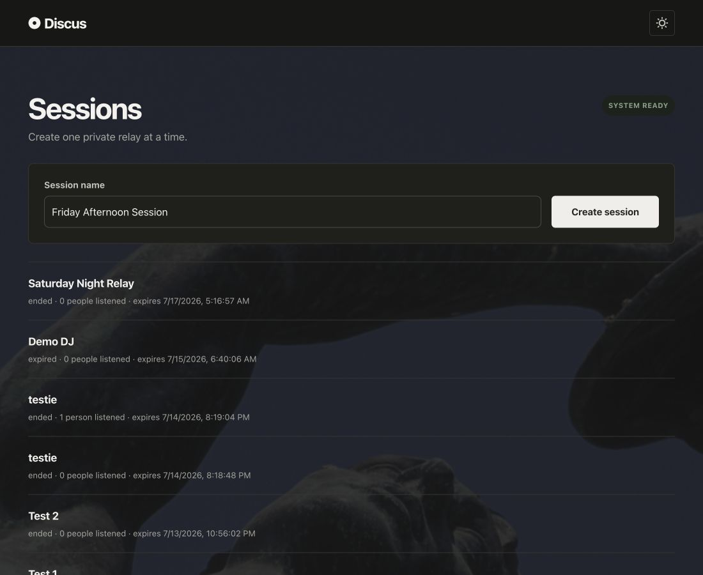

# Discus

Discus is a private, browser-based stereo audio relay for remote DJs. It publishes mixer or audio-interface input as Opus over WebRTC and provides separate, expiring links for DJs and listeners.

## Features

- Private producer, DJ, and listener access
- WHIP/WHEP streaming through MediaMTX
- Stereo input metering and audio-device selection
- Live and historical listener counts
- Opt-in server-side session recording with private, multi-part replay
- Dark-only responsive interface
- Listener jitter buffering for steadier playback
- Docker deployment with Caddy-managed HTTPS

## Screenshot



## Development

Requirements: Node.js 24+, npm, and a Chromium-based browser.

```sh
npm install
ADMIN_PASSWORD=relay-test-password \
TOKEN_SECRET=dev-only-token-secret-at-least-32-bytes \
MEDIAMTX_AUTH_SECRET=dev-media-auth-secret \
npm run dev
```

Open `http://localhost:3000/admin`. Remote audio capture requires HTTPS.

Run the checks with:

```sh
npm run check
npm run test:e2e
```

## Deployment

Requirements:

- A Linux server with Docker Engine and the Docker Compose plugin
- A public DNS name pointed at the server
- TCP/UDP 443 and TCP/UDP 8189 allowed through the server firewall or router

Copy the environment template, replace every example secret, and set your public hostname:

```sh
cp .env.example .env
# Edit .env and set DJ_RELAY_DOMAIN=discus.example.com
docker compose config --quiet
docker compose up -d --build
```

Keep the application and MediaMTX administration ports private. Caddy obtains the HTTPS certificate and proxies the public web and media routes.

### Session recordings

Producers can enable **Record this session** while creating a session. The setting is off by default and cannot be enabled after creation. Recording-enabled sessions use MediaMTX's native fMP4 recorder and keep the existing 192 kbps stereo Opus relay without transcoding. DJs and listeners see a recording disclosure while the broadcast is active.

When the broadcast ends, its original listener link becomes private replay access. Reconnects appear as ordered recording parts and the player advances through them without filling gaps. Producers can review and permanently delete archives from `/admin/recordings`.

The `relay-recordings` Docker volume stores media separately from SQLite and is retained across deployments until a producer deletes it. It is not included in the SQLite backup or copied off-device. MediaMTX playback on port 9996 is reachable only inside the Docker network; the application authorizes and proxies every replay request.

### Discord announcements

To announce the first time a session goes live in one Discord channel, create an incoming webhook in that channel's **Integrations → Webhooks** settings and add its URL to `.env`:

```sh
DISCORD_WEBHOOK_URL=https://discord.com/api/webhooks/...
```

The integration is optional. When configured, Discus posts the session name and a private, expiring listener link. A Discord delivery failure is logged but never prevents the broadcast from going live. Treat the webhook URL as a secret.

For repeat deployments from another computer, use any SSH-accessible Linux host:

```sh
./scripts/deploy-server.sh deploy@server.example.com
```

The default deployment path is `/opt/discus`. Override it when needed:

```sh
REMOTE_DIR=/srv/discus ./scripts/deploy-server.sh deploy@server.example.com
```

The remote `.env`, Docker volumes, runtime data, secrets, backups, and generated test artifacts are preserved or excluded from Git.
